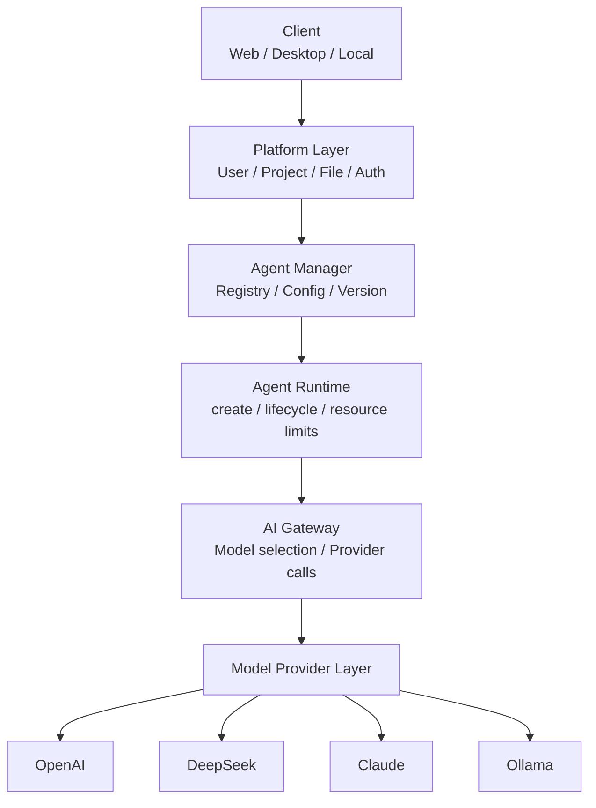

# DevPilot AI 系统设计文档 SDD V1.0

## 1. 系统概述

DevPilot AI 是一个面向软件工程生命周期的 AI 平台。系统通过统一的 Agent 接口、模型抽象层和运行环境，为开发者提供项目管理、文件管理、AI 能力调用、Agent 管理和模型接入能力。

平台加载官方 Agent
↓
Agent Runtime 创建 Agent 实例
↓
用户调用 Agent
↓
Runtime 调度执行
↓
Agent 通过 AI Gateway 调用模型
↓
记录任务状态与执行结果

## 2. 设计目标

- 构建可扩展的平台化架构
- 统一接入多模型
- 支持不同 Agent 能力
- 保证后续可扩展到本地部署和私有化部署
- 兼顾工程可维护性与可演进性

**核心设计原则（建议加入第2节设计目标后）**

DevPilot AI 的核心设计原则是平台能力与 AI 能力解耦。平台负责用户、项目、Agent、模型和运行环境的统一管理；Agent 负责具体的软件工程任务；模型通过 Provider 抽象进行统一接入。

## 3. 总体架构



整体架构可分为以下几个关键能力层：

1. Client 层：负责用户交互
2. Platform 层：负责项目、权限、文件、用户管理
3. Agent Manager 层：负责 Agent 元数据管理（注册/版本/权限/配置）
4. Agent Runtime 层：负责创建并运行 Agent 实例、管理执行状态与资源限制（负责 Agent 调度与运行时决策）
5. AI Gateway / Provider 层：负责模型选择、Provider 接入、上下文拼装、APIKey 与计费统计（不负责 Agent 实例调度）

## 4. 系统模块

### 4.1 Client

技术栈：
- Vue3
- TypeScript
- Element Plus

职责：
- 用户界面展示
- 用户操作交互
- 调用后端 API
- 展示 AI 分析结果

### 4.2 Platform Layer

负责平台核心能力：
- 用户服务：登录、注册、权限管理
- 项目服务：创建项目、文件上传、项目管理
- 文件服务：文件解析、存储管理
- Agent 管理：注册（内部）、配置、版本

### 4.3 AI Gateway

AI Gateway 是本系统的模型接入与调用中间层，负责统一接入 AI 能力。

主要职责：
- 模型选择与路由
- Provider（模型）调用封装与重试/超时策略
- API Key / 密钥管理（密钥安全存储）
- Token / 费用统计与限额控制
- 上下文拼装与短期上下文管理

注意：AI Gateway 负责“模型相关”的决策，不负责 Agent 实例的创建或运行时调度，Agent 的调度与运行由 `Agent Runtime` 负责。

### 4.4 Agent Runtime

Agent Runtime 负责运行具体 Agent：

主要职责：
- 创建 Agent 实例并管理其生命周期
- 执行 Agent 的调度决策（何时、在哪、以何种资源运行）
- 管理执行状态、超时、重试与资源限制
- 校验输入 Schema，调用工具或模型（通过 AI Gateway）并生成结构化输出
- 返回执行结果并记录审计日志

回答问题：“这个 Agent 现在怎么运行？”

### 4.5 Model Provider

提供统一的 LLM 抽象接口：

```text
LLMProvider
├── OpenAIProvider
├── DeepSeekProvider
├── ClaudeProvider
├── OllamaProvider
└── ...
```

Agent 只依赖统一接口，而不关心底层具体模型。

## 5. Agent Plugin Architecture

系统未来将以 Agent 为核心能力扩展单元。

### Agent 抽象定义

```text
Agent
├── Name
├── Version
├── Description
├── Input Schema
├── Output Schema
├── Tools
└── Runtime
```

示例：
- CodeExplainAgent
- DebugAgent
- PRReviewAgent
- TestAgent
- DocAgent

### 第一阶段设计（V1 建议精简范围）

第一阶段仅支持平台官方 Agent，第三方 Agent 接入与注册接口留待 V2。V1 以交付可运行的最小闭环为目标：

- 前端（Vue3）基础管理界面
- 后端基础平台（用户/项目/文件）和简单 API
- AI Gateway：模型接入与调用抽象（对接 1-2 个 Provider）
- Agent Runtime：支持一个官方 Agent（例如 `CodeExplainAgent`）的完整执行链路

暂不优先实现（可列为后续版本）：

- Docker / Kubernetes 多节点运行
- 第三方 Agent 注册与 Marketplace
- 分布式任务队列与复杂调度
- 全量沙箱/容器化隔离（V2 规划）

## 6. LLM Provider Architecture

系统通过 Provider 层隔离模型实现：

- OpenAI
- Claude
- DeepSeek
- Ollama
- 用户自定义模型接口

这样可以实现：
- 模型切换简单
- Agent 逻辑不受模型影响
- 后续支持私有化模型接入

## 7. 数据库设计

第一版采用轻量级核心数据模型：

### User 表
- id
- username
- password_hash
- create_time

### Project 表
- id
- user_id
- name
- storage_type   # local | object_storage | remote
- storage_reference  # 对应 storage 的引用，例如路径或 object key
- language
- create_time

### File 表
- id
- project_id
- file_name
- file_path
- content_type
- create_time

### Conversation 表
- id
- project_id
- question
- answer
- create_time

### AgentMetadata 表
- id
- name
- description
- runtime_type
- permissions   # JSON，预留权限声明字段
- create_time

### AgentVersion 表
- id
- agent_id
- version
- runtime_type
- entrypoint
- config
- status
- create_time

（注意：`agent_id` 为外键，明确 Agent 与多个版本的关系）

### Task 表
- id
- agent_id
- project_id
- status
- start_time
- end_time
- result

### ModelProvider 表（补充）
- id
- name
- provider_type   # openai / claude / ollama / custom
- endpoint
- model_name
- config
- credential_ref  # 对密钥的引用（不要明文存储 API Key）
- create_time

## 8. API 设计

### 用户登录

```http
POST /api/auth/login
```

请求：

```json
{
  "username": "test",
  "password": "123456"
}
```

返回：

```json
{
  "token": "xxxx",
  "user_id": 1
}
```

### 创建项目

```http
POST /api/project/create
```

### 上传文件

```http
POST /api/file/upload
```

### 查询 Agent

```http
GET /api/agents
```

返回：

```json
[
  {
    "name": "CodeExplainAgent",
    "version": "1.0"
  }
]
```

说明：V1 不对外提供 Agent 注册相关 HTTP API。官方 Agent 由平台通过配置或启动时加载并注册，第三方 Agent 的对外注册接口将留到 V2 设计。

### 执行 Agent

```http
POST /api/agent/execute
```

请求：

```json
{
  "project_id": 1001,
  "agent_name": "CodeExplainAgent",
  "file": "main.cpp"
}
```

返回：

```json
{
  "task_id": 10001
}
```

### 查询任务

```http
GET /api/task/{id}
```

返回：

```json
{
  "id": 10001,
  "status": "running",
  "result": null
}
```

## 9. 数据流设计

典型数据流如下：

1. 用户登录并创建项目
2. 上传项目文件
3. 选择 Agent 能力
4. Agent Runtime 创建实例并调度执行
5. Agent Runtime 通过 AI Gateway 调用 LLM Provider
6. Agent 返回结构化分析结果

## 10. 部署架构

### Cloud

```text
用户
 ↓
云端 DevPilot
 ↓
云端模型
```

### Local

```text
用户电脑
 ├── DevPilot Platform
 ├── Agent Runtime
 ├── Model Adapter
 └── Local LLM
```

### Hybrid

```text
本地项目代码
 ↓
Agent / Platform
 ↓
远程 LLM
```

在 Hybrid 模式下，平台应允许用户控制哪些数据可以发送至远程模型，并对项目代码、文件内容等敏感数据进行明确的数据流控制与脱敏策略。

## 11. 安全设计

- API Key 不明文存储
- 用户数据与项目数据进行权限隔离
- 对输入文件进行有效校验
- Agent 运行前进行权限控制
- 后续支持沙箱隔离与容器隔离

此外：
- 对 Agent 声明的权限（filesystem / network / shell / database）预留校验与审批流程
- 审计日志与执行回溯用于安全与合规检查

## 12. Agent 运行隔离

第一阶段不直接允许第三方 Agent 在主服务器运行。

后续可考虑：
- Docker 隔离
- Sandbox
- WASM
- 独立服务运行

## 13. 可扩展性设计

系统采用以下设计保证可扩展：
- 平台与 Agent 解耦
- AI Gateway 与 Provider 解耦
- Agent 遵循统一接口规范
- 后续可新增模型与 Agent 而不影响现有逻辑

架构图（简化版）：

```
                 DevPilot AI
                     │
          ┌──────────┴──────────┐
          │                     │
      Platform              AI System
          │                     │
   ┌──────┼──────┐       ┌──────┴──────┐
   │      │      │       │             │
 User  Project  File    Agent       AI Gateway
                         │              │
                    Agent Runtime    Provider
                         │              │
                    Agent Plugin      LLM
```

## 14. 技术选型

- 前端：Vue3 + TypeScript + Element Plus
- 后端：C++ + Drogon Framework
- 数据库：MySQL + Redis
- 容器：Docker Compose
- 模型接入：OpenAI / DeepSeek / Claude / Ollama

> AI Agent Runtime 不限制实现语言，平台通过接口协议支持不同语言开发的 Agent。未来可通过 HTTP / gRPC 连接 C++ 后端与 Python Agent，实现更灵活的 Agent 运行架构。

## 15. 版本演进

### V1 MVP 实现范围

实现：
- 用户系统
- 项目管理
- 文件上传
- Agent Metadata 管理
- AI Gateway
- 一个官方 Agent

不实现：
- 第三方 Agent 上传
- Agent 商店
- Kubernetes
- 多节点部署

### V2
- 支持更多官方 Agent
- Agent 权限系统（权限声明、校验与审批流程）
- Docker 隔离运行（对 Agent 提供容器化隔离方案）
- 对象存储支持（作为项目文件的可选存储后端）
- 更完善的任务管理（任务重试、优先级、监控）
- 支持第三方 Agent 的试运行机制（受限沙箱、审批流程）

### V3
- Agent Marketplace / 第三方 Agent 扩展生态
- 分布式 Task Queue 与 Worker 模型
- 服务拆分与多节点调度
- 更成熟的隔离与安全方案（沙箱、WASM、容器网络策略）

### V4
- Kubernetes / 弹性扩展
- GPU / 大模型部署
- 企业级私有化支持

## 16. 非功能性需求

- 性能：支持基础项目分析请求
- 安全：保护用户数据与 API Key
- 可维护性：采用分层架构与模块化设计
- 可扩展性：支持新增 Agent 和 Provider
